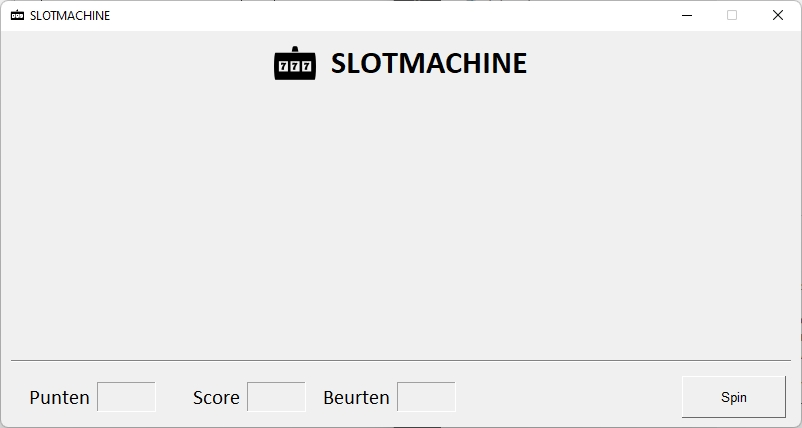
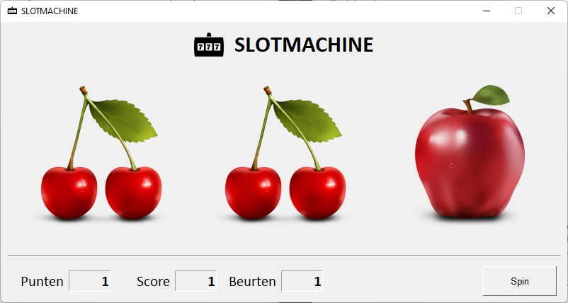
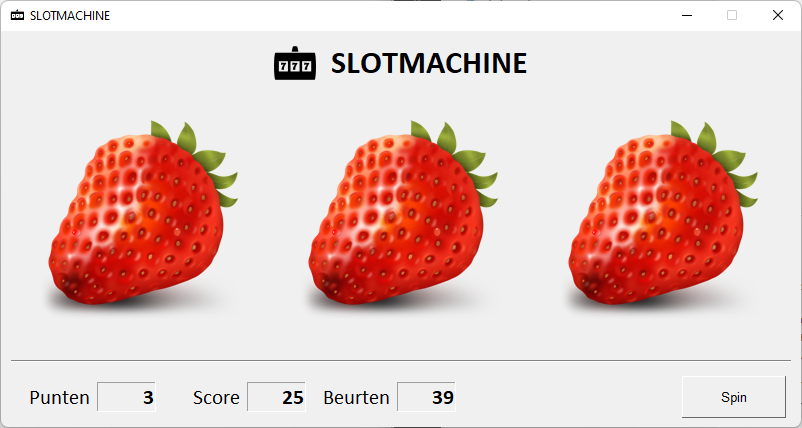
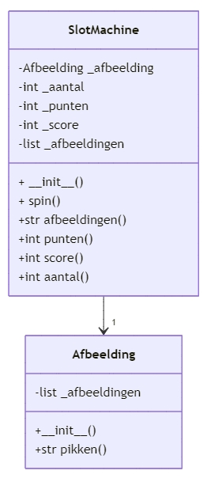

# Oefening 05

De Engelse term '*slot machine*' staat voor 'gokautomaat'.   Gokautomaat is het onderwerp van dit project.

## Opdracht

Je maakt een kleine applicatie met een grafische gebruikersinterface voor een gokautomaat.

Bij het opstarten van de applicatie krijg je volgend venster.  

 

De witruimte in het midden van het venster is gereserveerd voor afbeeldingen.  Onderaan in het venster onderscheiden we:

* punten: het aantal bij één spin

* score: het totaal aantal behaalde punten

* beurten: het aantal beurten

Klikt de speler op de knop 'Spin' dan worden drie willekeurige afbeeldingen geselecteerd uit een vaste verzameling met afbeeldingen.

Is het resultaat

* 3 verschillende afbeeldingen: 0 punten

* 2 gelijke afbeeldingen: 1 punt

* 3 gelijke afbeeldingen: 3 punten

 

 

 

## Structuur van het project

De structuur van het project staat hieronder afgebeeld.

```textile
│   main.py
│
├───_klassendiagram
│       klassendiagram
│
├───app
│       app.py
│       app_layout.py
│
├───assets
│       aardbei.png
│       appel.png
│       banaan.png
│       favicon.ico
│       kers.png
│       kiwi.png
│       logo.png
│       peer.png
│       perzik.png
│       pompoen.png
│       sinaas.png
│
├───bin
│       imagetkhelper.py
│
├───entiteit
        afbeelding.py
        slotmachine.py
```

Toelichting:

- main.py  
  root van het project, heeft als enige doel de eigenlijke applicatie te starten

- _klassendiagram  
  deze map bevat de markdown-bestanden met de nodige diagrammen
  
  - klassendiagram.md  
    bevat het UML-klassendiagram in 'mermaid' van de entiteitsklassen

- app  
  de Python-scripts in deze map staan in voor de grafische gebruikersinterface van de applicatie
  
  - app.py  
    bevat de klasse 'App' die instaat voor het hoofdvenster van de applicatie
  
  - app_layout.py  
    bevat de elementen waaruit de grafische interface wordt opgebouwd

- assets  
  bevat alle afbeeldingen nodig in d applicatie

- bin  
  aan deze map kennen we de scripts toe ter ondersteuning van de applicatie.
  
  - imagetkhelper.py  
    helperbestand waarmee je dynamisch een afbeelding kunt toekennen

- entiteit  
  container met de entiteitklassen
  
  - afbeelding.py  
    de klasse 'Afbeelding' is verantwoordelijk voor het willekeurig selecteren van een afbeelding uit de verzameling afbeeldingen
  - slotmachine.py   
    de klasse 'Slotmachine' is verantwoordelijk voor het spel.  Het maakt gebruik van de klasse 'Afbeelding' om per beurt drie willekeurige afbeeldingen op te halen, het aantal beurten bij te houden, de score van de huidige beurt te bepalen en ten slotte het totaal aan punten, de score bij te houden.

## Gebruikersinterface

De opbouw van de grafische gebruikersinterface staat hieronder afgebeeld.


**Aanwijzingen**

Voor de afbeeldingen '-IMG-0-', '-IMG-1-' en '-IMG-2-' gebruik je de afmetingen 200x200 met een padding van 30 rondomrond.

De tekstvelden '-INP-PUNTEN-', '-INP-SCORE-' en '-INP-BEURTEN-' zet je in alleen-lezen mode.

Maak de knop '-BTN-SPIN-' 12x2 groot.  De knop is rechts uitgelijnd in het venster.

## Entiteitklassen

De klasse 'App' staat in voor de grafische gebruikersinterface maar voor de eigenlijke slotmachine is de klasse 'SlotMachine' verantwoordelijk, het representeert een object in de reële wereld.  De verantwoordelijkheid voor het beheren van de afbeeldingen en het willekeurig selecteren van een afbeelding delegeren we naar de klasse 'Afbeelding'.

**Entiteitsklasse 'Afbeelding'**

Deze klasse is verantwoordelijk voor het beheren van de afbeeldingen en het willekeurig selecteren van een afbeelding uit de verzameling.

De afbeeldingen voor de slotmachine kennen we toe aan de eigenschap `_afbeeldingen`, een list met de opsomming van de afbeeldingen waarvan de slotmachine gebruik maakt.  

Met de methode `kies()` wordt een willekeurige afbeelding uit de verzameling `_afbeeldingen` geselecteerd en weergegeven.

Voor het willekeurig selecteren van een element uit een list kan men gebruik maken van de methode `choices()` uit de module random.

```python
from random import choices
```

Om een willekeurige element uit een lust te selecteren maken we gebruik van volgend statement

```python
element = choices(list, k=1)
```

De parameter k geeft aan hoeveel elementen uit de list geselecteerd worden.  Het resultaat is met k=1 een list met 1 element.

```python
choices(self._afbeeldingen, k=1)[0]
```


**Entiteitsklasse 'SlotMachine'**

De klasse 'SlotMachine' is - zoals de naam aangeeft - verantwoordelijk voor het spel, de werking van de gokautomaat.

Er wordt gebruik gemaakt van volgende eigenschappen:

* `_aantal`  
  een geheel getal met het aantal keren dat de gebruiker op de knop 'Spin' heeft gedrukt

* `_score`  
  met het totaal aantal verdiende punten

* `_punten`  
  met het aantal punten van de huidige spin

* `_afbeelding`  
  de klasse 'SlotMachine' maakt gebruik van de klasse 'Afbeelding' om willekeurige afbeeldingen uit de verzameling met afbeeldingen te selecteren.  Een instantie van de klasse 'Afbeelding' wordt aan deze eigenschap toegekend

* `_afbeeldingen`  
  een list met drie willekeurig geselecteerde afbeeldingen van de huidige spin.

Verder maken we gebruik van volgende methoden:

* `spin()`  
  deze methode wordt aangeroepen wanneer de gebruiker op de knop 'Spin' klikt en hiermee wordt het aantal 'spins' met 1 verhoogd, worden drie willekeurige afbeeldingen geselecteerd, wordt het aantal punten van de 'spin' bepaald en wordt de score vermeerderd met het aantal punten van de huidige spin.

* `afbeeldingen()`  
  retourneert de list met de drie geselecteerde afbeeldingen

* `punten()`  
  retourneert het aantal bekomen punten van de huidige spin

* `score()`  
  retourneert de score, het totaal aan behaalde punten

* `aantal()`  
  retourneert het aantal keren dat de gebruiker op de knop 'Spin' heeft geklikt.

**Klassendiagram en doctest**

Maak een klassendiagram met 'mermaid' van beide entiteitsklassen.  In het klassendiagram duid je de cardinaliteit tussen beide klasse aan.



Voorzie beide van de nodige commentaar.

Aan de klasse 'Afbeelding' ken je ook een doctest toe.